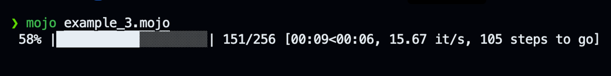
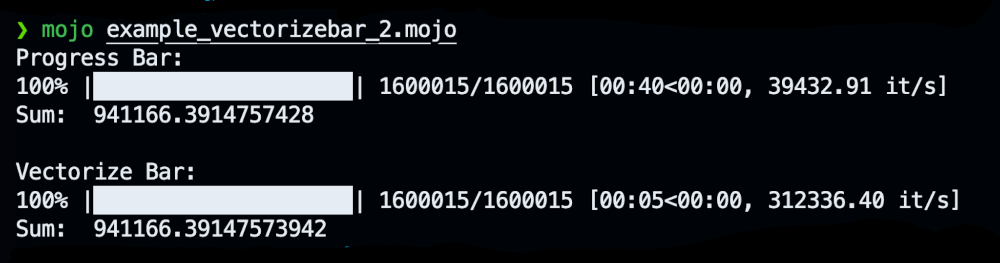

# progressbar.🔥

A lightweight and customizable progress bar for Mojo, meant for tracking the progress of long-running operations in loops.

## Usage

In its simplest use case, you specify the total number of iterations and provide a callback function as parameter that will be called for each iteration:

```python
from time import sleep
from mopro import progress_bar

fn main():
    
    @parameter
    fn one_step(i: Int) -> None:
        # your operations here
        sleep(0.01)

    progress_bar[one_step](
        total=256
    )
```


### Terminating the loop

When the callback function returns a boolean value, the loop will terminate if it returns `False`.

```python
from time import sleep
from mopro import progress_bar

fn main():

    var stop = 197

    @parameter
    fn one_step(i: Int) -> Bool:
        sleep(0.01)
        return i<stop

    progress_bar[one_step](
        total=256
    )
```

### Customizations

Some basic customization options are availabe.

```python
from time import sleep
from mopro import progress_bar

fn main():

    @parameter
    fn one_step(i: Int):
        sleep(0.01)
        
    progress_bar[one_step](
        total=256,
        prefix="Epoch:", 
        bar_size=20,
        bar_fill = "🔥",
        bar_empty = "  "
    )
```


### Runtime customization

Often, we want to display additional information along with the progress bar, such as the current value of the loss function in deep learning applications. As shown in the following example, the callback function can include a `BarSettings` argument, which allows runtime customization of the Progress Bar. Here, we use the postfix setting to display the number of iterations remaining.

```python
from time import sleep
from mopro import progress_bar,BarSettings

fn main():
    var total = 256

    @parameter
    fn one_step(i: Int,inout bs:BarSettings):
        sleep(0.01)
        bs.postfix = str(total-i-1) + " steps to go" 
        
    progress_bar[one_step](
        total=total,
        bar_size=20
    )
```



The following settings are available for runtime customization:

```rust
struct BarSettings:
    var prefix: String
    var postfix: String
    var bar_size: Int
    var bar_fill: String
    var bar_empty: String
```

## Vectorize Bar

The usage of the Progress Bar is in a way quite similar to Mojo's [vectorize](https://docs.modular.com/mojo/stdlib/algorithm/functional/vectorize) function, making it straightforward to combine the two functionalities. To achieve this, we added the `vectorize_bar` method to our repository.

Let's compare the performance of the vectorized and non-vectorized versions of a computationally intensive task with the use of `progress_bar` and `vectorize_bar`.

```python
from time import sleep
from mopro import progress_bar,vectorize_bar

alias NUM = 100000*16+15
alias dtype = DType.float64
alias simd_width=4*simdwidthof[dtype]()

fn main():

    var vec = DTypePointer[dtype].alloc(NUM)
    for i in range(NUM):
        vec[i] = i/(i*1.7+4)
   
    var sum:Scalar[dtype] = 0

    @parameter
    fn one_step(i: Int):
        sum+= vec[i]

    print("Progress Bar:")

    progress_bar[one_step](total=NUM,bar_size=20)
    
    print("\nSum: ", sum)

    sum = 0

    @parameter
    fn vectorized_step[width:Int](iv: Int):
        sum+= vec.load[width=width](iv).reduce_add()

    print("\nVectorize Bar:")

    vectorize_bar[vectorized_step,simd_width](total=NUM,bar_size=20)
    
    print("\nSum: ", sum)

    vec.free()
```



As we can see, the vectorized operation took 5 seconds, compared to 40 seconds for the non-vectorized operation.

## Remarks

- __Nice, but i prefer tqdm:__ Check out [Are We Done Yet](https://github.com/Ryul0rd/awdy) for an advanced progress bar implementation in Mojo that is more similar to [tqdm](https://github.com/tqdm/tqdm). Love the name🔥
- __Callback as Closure:__ For the sake of flexibility, we decided to define the callback function as closure. If this approach poses any limitations for you, please let us know.
- __Contribute and Improve!__ Feel free to modify and use the source code as you like. If you have enhancements that could benefit others, your pull requests are highly encouraged.

## Changelog

- 2024.05.28
  - Introducing `BarSettings` for runtime customization of the Progress Bar
- 2024.05.28
  - Added `vectorize_bar`
  - Enabling closure function without `Bool` as return value.
- 2024.05.27
  - Initial repository setup and commit.

## License

MIT
