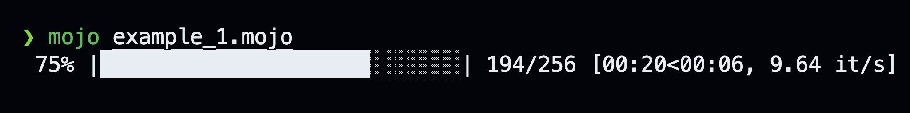

# progressbar.🔥

A lightweight and customizable progress bar for Mojo, meant for tracking the progress of long-running operations in loops.

## Usage

In its simplest use case, you specify the total number of iterations and provide a callback function as parameter that will be called for each iteration:

```python
from time import sleep
from mopro import progress_bar

fn main():

    @parameter
    fn one_step(i: Int) -> Bool:
        sleep(0.01)
        return True

    progress_bar[one_step](
        total=256
    )
```



### Terminating the loop

When the callback function returns `False`, the loop will terminate.


```python
from time import sleep
from mopro import progress_bar

fn main():

    var stop = 197

    @parameter
    fn one_step(i: Int) -> Bool:
        sleep(0.01)
        return i<stop

    progress_bar[one_step](
        total=256
    )
```

### Customizations

```python
from time import sleep
from mopro import progress_bar

fn main():

    @parameter
    fn one_step(i: Int) -> Bool:
        sleep(0.01)
        return True
        
    progress_bar[one_step](
        total=256,
        prefix="Epoch:", 
        bar_size=20,
        bar_fill = "🔥",
        bar_empty = "  "
    )
```


## Remarks

- __Looking for More Advanced Features?__ Check out [Are We Done Yet](https://github.com/Ryul0rd/awdy) for a more advanced progress bar implementation in Mojo. Hillarious name - love it 🔥
- __Callback as Closure:__ For the sake of flexibility, the callback function has to be defined as a closure. If this approach poses any limitations for you, please let us know.
- __Contribute and Improve!__ Feel free to modify and use the source code as you like. If you have enhancements that could benefit others, your pull requests are highly encouraged.

## License

MIT
